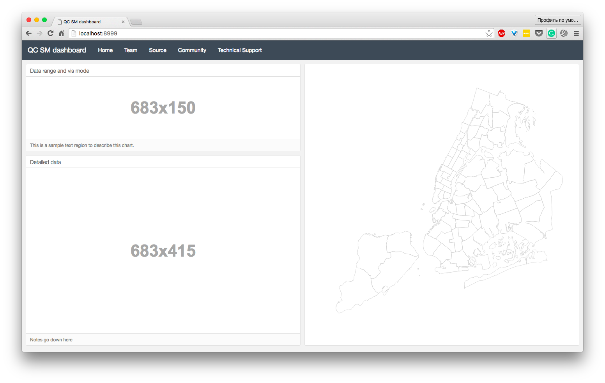

# Capstone dashboard
CUSP Capstone dashboard

*current state screenshot*

[Live version (mirroring this repository)](https://casyfill.github.io/Capstone_dashboard/)

Repository will conclude:
- Flask server settings
- Dashboard online tool
- Dummy syntetic dataset

### TODO: FrontEnd

- [ ] basic dashboard layout
- [ ] config basic get request (Event info)
- [ ] render generic data info on chosen Event
- [ ] map
- [ ] otherEvents table

### TODO: Backend

- [ ] deploy basic Flask server, inherit dashboard template
- [ ] serve get_info request
- [ ] database (?)
- [ ] serve bysiness_logic
- [ ] data update

### Credits and links
- Dashboard layout created by [keen.io](keen.io)
- Zip boundaries were processed into topojson using [mapshaper](www.mapshaper.org)
- [responsive svg help](http://stackoverflow.com/questions/9400615/whats-the-best-way-to-make-a-d3-js-visualisation-layout-responsive)
